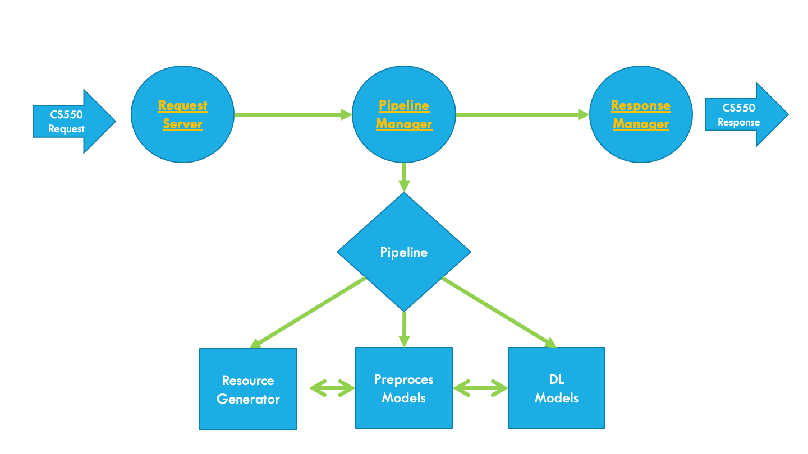

# Deep-Learning-Pipeline-for-Deployment
Example Deeplearning service for deployment.

# Project Intend
  

Deep learning systems has **preprocess** steps like image resize, image cropping, word stemming or removing stopwords. Although these processes run on CPU, deep learning models work on GPU.

  

A classical deep learning model generally consists of 4 stages which are `reading data`, `preprocess`, `model prediction`, `postprocess`. These process works sequential but it doesn't have to be **sequential** because `model prediction` is works on GPU generally. So we can make **improvement** in here.

  

If we can look at the **pipeline** of the two deep learning models which works sequential( like models: pose estimation, flow prediction, some classification tasks after extracting embeddings of words etc.) we will see that preprocess of model 1 and preprocess of model 2 are holding the GPU idle in every image/sentence/matrix.

  

This project aims to parallelizing to preprocess steps so GPU will have things to do every time.  

A pipeline has been created with more than 1 model. The pipeline consist of sections which are reading data, preprocess of all models and dl models. Some of these parts connected with in memory queue (`process queue`).  
For instance; when pipeline starts, data always will readed and will be putted on queue. `Preprocess 1` and `Preprocess 2` (if necessary) will consume these queue. If the queue is not empty, the `Preprocess 1` will work and it will put results on another queue which consumed by `DL MODEL 1`. `Preprocess 2` consume the DL MODEL 1 Results and its going like that ...     

# Project Design
This project is intended as a web service. So a simple `flask` web service is used.  
Project consist of 3 parts which are `Request Server`, `Pipeline Manager`, and `Response Manager`. All of them works on different cores.   
`Request Server` can be modified for different post requests.  
`Pipeline Manager` has pipelines which consist of `Data Reading`, `Preprocesses`,`Deeplearning Models`. There can be more than one pipeline and they fully customizable. Also the `preprocesses` can be work on same core or different cores depends on choice. 
`Response Manager` is for **asynchronous messaging**. `Request Server` is doing only request validation. Results will send from `Response Manager` in an appropriate form.   

An example API design of asynchronous messaging for 'CS550-Advanced Object-Oriented Programming -Design Patterns' course can be found at [Cs550ApiDesign.md](docs/Cs550ApiDesign.md)

  

# Acknowledge

This project also realized as a term project for CS-550 Advanced Object Oriented Programming -Design Patterns in Ozyegin University. So mainly these patterns are used:
- Singleton Pattern - Config
- Strategy Pattern - Manager Module
- Factory Pattern - Data Resources Module
- Mediator Pattern - Pipeline Module
- Simple Factory - Creating Pipeline in Pipeline Module
- Template Pattern - Pipeline Module

The presentation can be found under [docs/DeepLearningPipelinePowerPoint](docs/DeepLearningPipelinePowerPoint.pdf).

A simple GUI is developed by @esumengen due to obligation of course . So thanks for his contribution.
All other things developed by Yakup Görür - @ykpgrr
